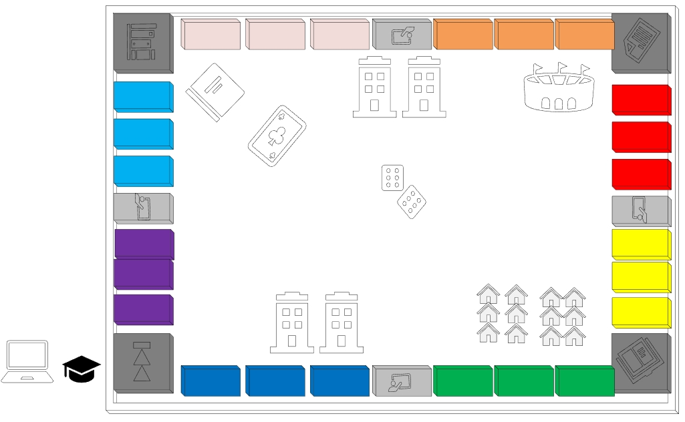
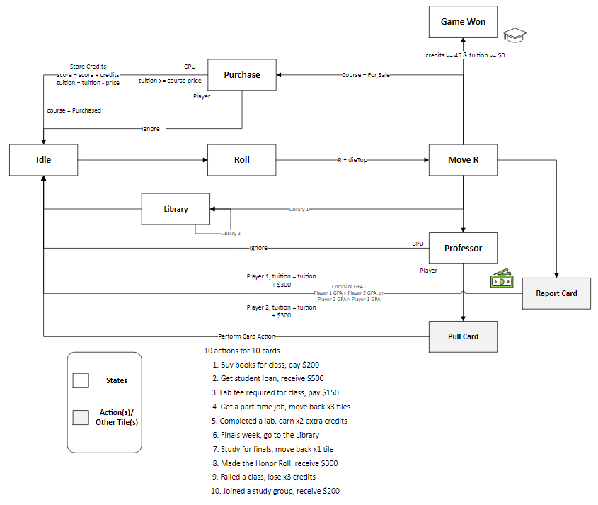

# College Cashflow

created by: Seth Romanowski

created with: Unity Game Engine

<!--TOC-->
  - [Game Player(s)](#game-players)
  - [Game Rules](#game-rules)
  - [Game Scenes](#game-scenes)
    - [Start Scene -](#start-scene-)
    - [Board Game Scene -](#board-game-scene-)
    - [End Scene -](#end-scene-)
  - [Finite State Machine (FSM)](#finite-state-machine-fsm)
    - [Diagram](#diagram)
    - [Machine States](#machine-states)
  - [Course / Tile Overview](#course-tile-overview)
    - [**Course Tiles**:](#course-tiles)
    - [**"Special" Tiles**:](#special-tiles)
  - [Image Credit](#image-credit)
  - [Models Credit](#models-credit)
  - [Sound Credit](#sound-credit)
<!--/TOC-->

---

**Objective** - graduate college without going broke

- player(s) begin college with $1,750 for tuition
- when a player acquires 45 credits or more, and has $0 or more for tuition, then the game is over 
    - player(s) may have < $0 for tuition but may not finish the game until their balance is $0 or more.
    

---

## Game Player(s)
- Player 1 - Macbook Laptop = User
- Player 2 - Graduation Hat = CPU or User

## Game Rules
- Player(s) advance by rolling the die, and moving the resulting number of tiles
    - If playing against the CPU, the die is rolled and the player moves automatically
- Each player may select a major after their initial roll
    - i.e. Player 1: roll die, select major, perform action (repeat for Player 2)
- If player(s) land on a tile that's a course they may either purchase it or ignore it
    - **must** be for sale aka not previously purchased by a player
    - **must** be purchased for the price provided, unless it's a major course then it is 1/2 price. (*See table below for major courses*)
    - if purchased, the player receives the number of credits associated to the course
    - once a course is purchased, it is unavailable to the other player
    - if playing against the CPU, the course is purchased automatically (provided player's tuition is greater than or equal to the course price)
- If player(s) land on a tile that's a professor, they may either pull a card or ignore it
    - if a card is pulled, the player **must** perform the action associated to the card
- When player(s) pass the starting tile (Tile 0), a new semester begins, and they receive $50 added to their tuition
- If player(s) land on the library (1) tile (Tile 8), they must proceed to the next player's turn
- If player(s) land on the library (2) tile (Tile 24), they must return to the library (1) tile (Tile 8)
- If player(s) land on the report card tile (Tile 16), the player's GPA is compared & the player with the highest GPA gets $300 add to their tuition

## Game Scenes
### Start Scene -
The start scene is the first scene displayed and it includes a button to start a new game.
- *Represents the beginning of college*
### Board Game Scene -

- *Mock-up diagram*

### End Scene -
The end scene is the last scene displayed and it includes a button to start a new game.
- *Represents graduating college*

---

## Finite State Machine (FSM)
### Diagram

### Machine States
    - moveRoll
    - idle
    - library
    - professor
    - purchase
    - gameWon

## Course / Tile Overview
### **Course Tiles**:
    - Course Name
    - Course Price
    - Course Credits

### **"Special" Tiles**:
    - START
        when player(s) pass this tile they get $50 added to their tuition
    - PROFESSOR 1/2/3/4
        provide player(s) the opportunity to pull a card, then must perform 1 of 10 actions
    - LIBRARY 1/2
        library (1), proceed to next player
        library (2), return to library (1) tile
    - REPORT CARD
        performs a comparison of the player's GPA & player with highest GPA gets $300 added to their tuition

**Courses by Major**

| Major | Course | 
| ---------------- | --------- |
| General Studies  | ENG-W101  |
|                  | ENG-W201  |
|                  | ENG-W202  |
|                  | SPAN-S101 |
|                  | SPAN-S102 |
|                  | SPAN-S202 |
| Business         | MATH-M118 |
|                  | MATH-M125 |
|                  | MATH-M208 |
|                  | BUS-K201  |
|                  | BUS-K301  |
|                  | BUS-K302  |
| Computer Science | CSCI-C151 |
|                  | CSCI-C243 |
|                  | CSCI-C311 |
|                  | INFO-I101 |
|                  | INFO-I201 |
|                  | INFO-I202 |
| Science          | BIOL-L101 |
|                  | BIOL-L211 |
|                  | BIOL-L311 |
|                  | CHEM-C105 |
|                  | CHEM-C106 |
|                  | CHEM-C125 |

**Table of Each Course / Tile**

| Tile # | Course / Tile | Price | Credits |
| ------ | ------------- | ----- | ------- |
| 0      | START         | $0    | 0       |
| 1      | ENG-W101      | $60   | 3       |
| 2      | ENG-W201      | $60   | 3       |
| 3      | ENG-W202      | $60   | 3       |
| 4      | PROFESSOR 1   | $0    | 0       |
| 5      | INFO-I101     | $100  | 3       |
| 6      | INFO-I201     | $100  | 3       |
| 7      | INFO-I202     | $120  | 3       |
| 8      | LIBRARY 1     | $0    | 0       |
| 9      | SPAN-S101     | $140  | 3       |
| 10     | SPAN-S102     | $140  | 3       |
| 11     | SPAN-S202     | $160  | 3       |
| 12     | PROFESSOR 2   | $0    | 0       |
| 13     | CSCI-C151     | $180  | 3       |
| 14     | CSCI-C243     | $180  | 3       |
| 15     | CSCI-C311     | $200  | 3       |
| 16     | REPORT CARD   | $0    | 0       |
| 17     | BIOL-L101     | $220  | 5       |
| 18     | BIOL-L211     | $220  | 5       |
| 19     | BIOL-L311     | $240  | 5       |
| 20     | PROFESSOR 3   | $0    | 0       |
| 21     | MATH-M118     | $260  | 5       |
| 22     | MATH-M125     | $260  | 5       |
| 23     | MATH-M208     | $280  | 5       |
| 24     | LIBRARY 2     | $0    | 0       |
| 25     | CHEM-C105     | $300  | 5       |
| 26     | CHEM-C106     | $300  | 5       |
| 27     | CHEM-C125     | $320  | 5       |
| 28     | PROFESSOR 4   | $0    | 0       |
| 29     | BUS-K201      | $350  | 5       |
| 30     | BUS-K301      | $350  | 5       |
| 31     | BUS-K302      | $400  | 5       |

## Image Credit

| Images |
| --------------------------------------------------------------------------------------------------------------------------------------------------------------------------------------------------------------------------------------------------------------------------------------------------------------------------------------------------------------------------- |
| [Brunette Teacher stock illustration](https://www.istockphoto.com/vector/brunette-teacher-gm165906501-20385433)       |
| [Blue ceramic tile mosaic in swimming pool Vector illustration Eps 10](https://img.freepik.com/premium-vector/blue-ceramic-tile-mosaic-swimming-pool-vector-illustration-eps-10_230920-1005.jpg?w=826)                                                                                                                                                                      |
| [Grid paper Stock Vector Images](https://st.depositphotos.com/1427101/4343/v/450/depositphotos_43433909-stock-illustration-blue-grid-paper.jpg)                                                                                                                                                                                                                             |
| [Male Teacher Stock](https://thumbs.dreamstime.com/b/cartoon-male-teacher-illustration-51245540.jpg?w=360)                                                                                                                                                                                                                                                                  |
| [Green tiles texture seamless illustration. Green tiles texture seamless pattern vector illustration](https://www.dreamstime.com/stock-illustration-green-tiles-texture-seamless-illustration-pattern-vector-image86609664)                                                                                                                                                 |
| [clip art library - Library Building Clipart - Library Building Library Clipart - Png Download](https://www.pinclipart.com/maxpin/TwJTi/)                                                                                                                                                                                                                                   |
| [Professor II Teaching (Remix of Remix)](https://freesvg.org/1528665403)                                                                                                                                                                                                                                                                                                    |
| [Orange tile texture in different shade](https://www.dreamstime.com/royalty-free-stock-images-orange-tile-texture-image19885149)                                                                                                                                                                                                                                            |
| [Comic strip tile backgrounds pink.](https://www.rawpixel.com/image/12668138/comic-strip-tile-backgrounds-pink-generated-image-rawpixel)                                                                                                                                                                                                                                    |
| [Deep Purple Glass Tile Background Seamless](https://www.commentnation.com/background.php?MyFile=deep_purple_glass_tile_background_seamless.php&ID=C99.php)                                                                                                                                                                                                                 |
| [Premium AI Image \| Gold Yellow Square Mosaic Tiles for Ceramic Wall](https://img.freepik.com/premium-photo/gold-yellow-square-mosaic-tiles-ceramic-wall_1031251-1886.jpg?w=2000)                                                                                                                                                                                          |
| [Cartoon urban cityscape with college campus facade or academy for students, entrance to library, high school or university architecture background. University campus city building vector illustration](https://www.dreamstime.com/cartoon-urban-cityscape-college-campus-facade-academy-students-entrance-to-library-high-school-university-architecture-image204116809) |
| [Stress clipart college stress](https://webstockreview.net/images/stress-clipart-college-stress.png)                                                                                                                                                                                                                                                                        |
| [Teacher Welcome Sign Classroom Decor Illustration Clipart PNG](https://www.pngall.com/teacher-png/download/40870/)                                                                                                                                                                                                                                                         |
| [Good Grades Clipart - Full Size Clipart (#5336336) - PinClipart](https://www.pinclipart.com/picdir/big/533-5336336_good-grades-clipart.png)                                                                                                                                                                                                                                |
| [Red plastic siding wall stock photo. Image of building - 11409442](https://thumbs.dreamstime.com/b/red-plastic-siding-wall-11409442.jpg)                                                                                                                                                                                                                                   |
| [Premium Vector \| Happy cute kid boy study hard think](https://i.pinimg.com/736x/24/ad/d0/24add0add9542dbc1d28dd4aa26d10fc.jpg)                                                                                                                                                                                                                                            |
| [What Is A Good Graduation Rate For A College?](https://tagvault.org/blog/what-is-a-good-graduation-rate-for-a-college/)                                                                                                                                                                                                                                                    |
| [University or College Students in Campus Scene.](https://thumbs.dreamstime.com/b/university-college-students-campus-scene-people-cartoon-characters-studying-relaxing-playing-sports-park-academic-165167035.jpg)                                                                                                                                                          |

## Models Credit
| Models |
| ----------------------------------------------------------------------------------- |
| [Graduation Hat](https://free3d.com/3d-model/graduation-hat-104829.html)            |
| [Building](https://free3d.com/3d-model/building-80759.html)                         |
| [Mac Laptop](https://free3d.com/3d-model/mac-laptop-211499.html)                    |
| [Knight](https://www.cs.iusb.edu/~dvrajito/teach/i355/lab10/lab10.zip)              | Lab 10 |
| [Baloon](https://www.cs.iusb.edu/~dvrajito/teach/i355/lab9/lab9.zip)                | Lab 9 |
| [Sports Stadium](https://free3d.com/3d-model/sports-stadium-59498.html)             |
| [House Complex](https://free3d.com/3d-model/house-complex-45918.html)               |
| [Die](https://www.cs.iusb.edu/~dvrajito/teach/i355/lab10/lab10.zip)                 | Lab 10 |
| [Road](https://free3d.com/3d-model/street-estrada-971348.html)                      |  |
| [Small Pine Tree](https://www.cs.iusb.edu/~dvrajito/teach/i355/lab6/lab6.zip)       | Lab 6 |

## Sound Credit
| Sounds |
| ---------------------------------------------------------------------------------- |
| [Cartoon success fanfare](https://www.zapsplat.com/music/cartoon-success-fanfare/) |
